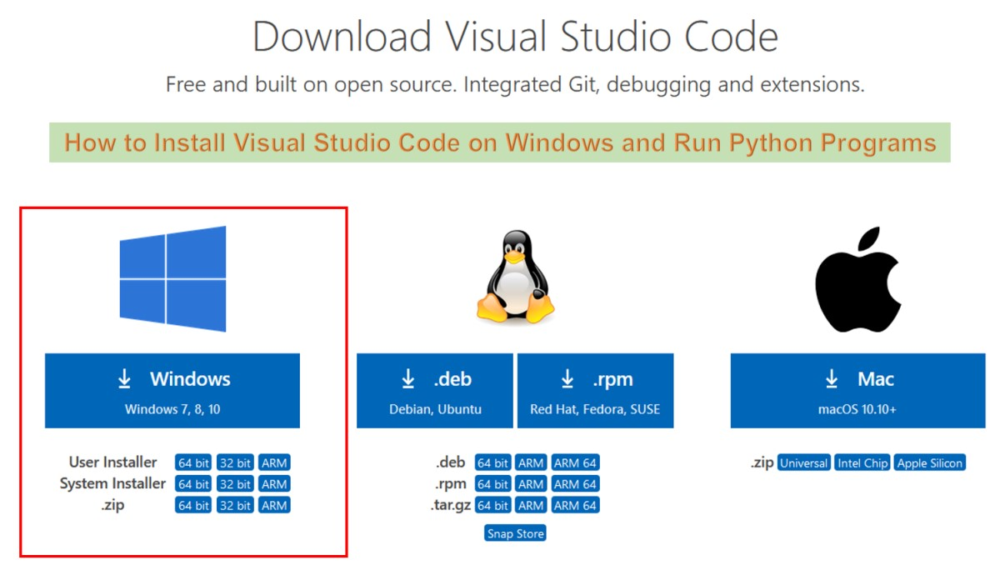
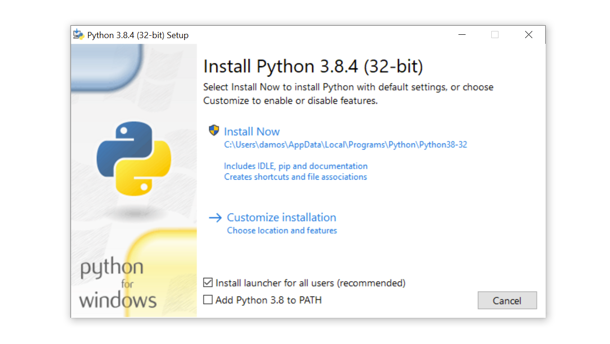
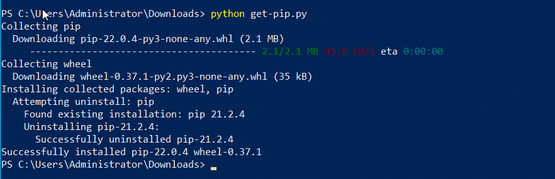
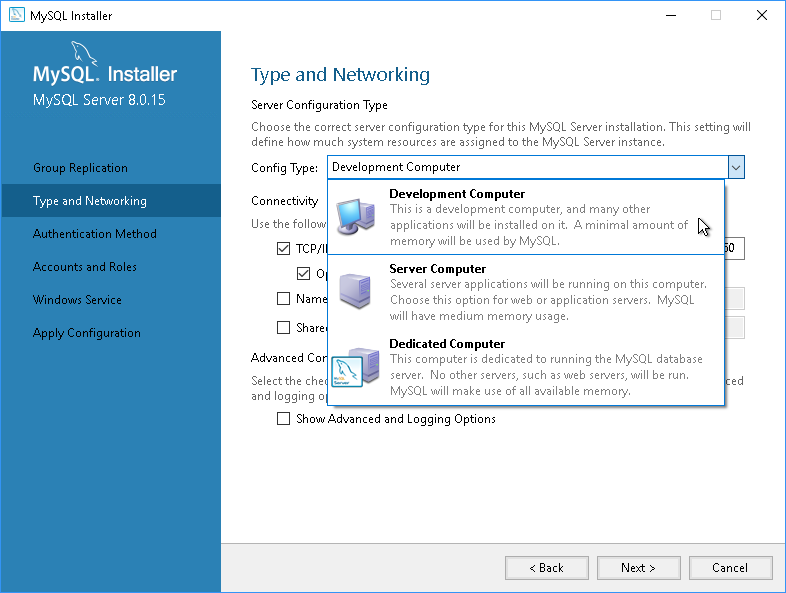
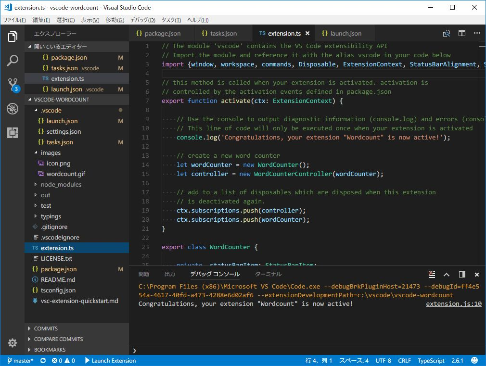

# Dev_Setup
Setup Development Environment

#Assignment: Setting Up Your Developer Environment

#Objective:
This assignment aims to familiarize you with the tools and configurations necessary to set up an efficient developer environment for software engineering projects. Completing this assignment will give you the skills required to set up a robust and productive workspace conducive to coding, debugging, version control, and collaboration.

#Tasks:
A git hub repository containing my sample project
https://github.com/Edwin411/Django_project.git

1. Select Your Operating System (OS):
   Choose an operating system that best suits your preferences and project requirements. Download and Install Windows 11. https://www.microsoft.com/software-download/windows11

   
   Challenges faced while installing:
Hardware Requirements: My older computer didn't meet the specific hardware requirements like TPM support for Windows 11, which prevented me from installing it successfully.
Driver Compatibility: I faced issues with certain hardware components lacking compatible drivers for Windows 11, causing problems after installation.
Installation Errors: During the upgrade process to Windows 11, I encountered errors related to disk partitioning and firmware, and at times, downloads didn't complete properly

2. Install a Text Editor or Integrated Development Environment (IDE):
   Select and install a text editor or IDE suitable for your programming languages and workflow. Download and Install Visual Studio Code. https://code.visualstudio.com/Download

Challenges faced while installing:
System Compatibility Issues: I ran into issues where VS Code required specific versions of operating systems or dependencies that weren't available on my machine.
Installation Errors: During the installation process, I faced failures due to network problems, incomplete downloads, or conflicts with other software already installed on my system.
Configuration Problems: After installing VS Code, I struggled to configure extensions and settings properly. There were times when conflicts or errors in configuration files made this particularly frustrating.

3. Set Up Version Control System:
   Install Git and configure it on your local machine. Create a GitHub account for hosting your repositories. Initialize a Git repository for your project and make your first commit. https://github.com

Challenges faced while installing:
Path Configuration: Setting up Git to work correctly with the command line (especially on Windows) was more complicated than I anticipated. Getting the PATH configuration right took some trial and error.
Firewall or Proxy Issues: Connecting Git to remote repositories was a challenge because of firewall settings and proxy configurations that I had to navigate and adjust.
SSH Key Setup: Generating and configuring SSH keys for Git authentication proved confusing for me, especially ensuring they were set up correctly for accessing repositories.

4. Install Necessary Programming Languages and Runtimes:
  Instal Python from http://wwww.python.org programming language required for your project and install their respective compilers, interpreters, or runtimes. Ensure you have the necessary tools to build and execute your code.

Challenges faced while installing:
Version Compatibility: Managing Python versions and ensuring compatibility with installed packages was a bit of a headache, especially when I needed to use different versions of Python for different projects.
Environment Setup: Setting up virtual environments and managing dependencies with pip often led to dependency conflicts or errors, which took some troubleshooting to resolve.
Path Configuration: Configuring Python to work smoothly with the system PATH on Windows was a challenge. I had to figure out how to set environment variables correctly on Linux and macOS as well.

5. Install Package Managers:
   If applicable, install package managers like pip (Python).

Challenges faced while installing:
Network Issues: Downloading packages via pip was challenging due to network restrictions and proxy settings that sometimes prevented packages from downloading completely.
Dependency Resolution: Resolving dependencies when installing packages with pip was often tricky, especially when different packages required conflicting versions of the same dependency.
Permissions: Installing packages globally or in system directories often required elevated permissions, leading to permission denied errors that I had to work around.

6. Configure a Database (MySQL):
   Download and install MySQL database. https://dev.mysql.com/downloads/windows/installer/5.7.html

Challenges faced while installing:

Installation and Configuration: Installing MySQL and configuring it properly on my system was a significant challenge. I often faced issues with setting up passwords, configuring database directories, and ensuring that the MySQL service started correctly.

7. Set Up Development Environments and Virtualization (Optional):
   Consider using virtualization tools like Docker or virtual machines to isolate project dependencies and ensure consistent environments across different machines.

8. Explore Extensions and Plugins:
   Explore available extensions, plugins, and add-ons for your chosen text editor or IDE to enhance functionality, such as syntax highlighting, linting, code formatting, and version control integration

9. Document Your Setup:
    Create a comprehensive document outlining the steps you've taken to set up your developer environment. Include any configurations, customizations, or troubleshooting steps encountered during the process. 
Setting Up Developer Environment with Git, VS Code, Python, and MySQL

Setting up a robust developer environment is crucial for efficient coding and collaboration. This document outlines the steps to configure Git, VS Code, Python, and MySQL on your system.

Prerequisites
Ensure you have administrative rights on your system (for installations).
Basic familiarity with the command line interface (CLI).
Steps to Set Up the Environment
1. Installing Git
Git is essential for version control and collaboration.

Installation:

Download Git from https://git-scm.com/ and follow installation prompts.
Choose appropriate options (e.g., adjusting PATH environment) during installation.
Configuration:

Open a terminal and configure Git with your name and email:
arduino
Copy code
git config --global user.name "Your Name"
git config --global user.email "your.email@example.com"
2. Setting Up VS Code
Visual Studio Code (VS Code) is a versatile code editor with great support for Python and Git integration.

Installation:

Download VS Code from https://code.visualstudio.com/ and install it.
Extensions:

Install necessary extensions from the VS Code marketplace:
Python Extension for VS Code (by Microsoft)
GitLens — Git supercharged
Customizations:

Customize VS Code settings (File > Preferences > Settings):
Adjust editor preferences, theme, and keybindings as per personal preference.
3. Configuring Python
Python is a popular programming language for various applications, including web development and data analysis.

Installation:

Download Python from https://www.python.org/ and install it.
Make sure to add Python to PATH during installation.
Virtual Environments:

Use virtual environments for project isolation:
bash
Copy code
python -m venv myenv
source myenv/bin/activate  (on macOS/Linux)
.\myenv\Scripts\activate   (on Windows)
4. Installing MySQL
MySQL is a widely used relational database management system.

Installation:

Download MySQL Community Server from https://dev.mysql.com/downloads/mysql/ and install it.
During installation, set the root password and remember it.
Configuration:

Configure MySQL:
Start MySQL service (on Windows, via services.msc; on macOS/Linux, via systemctl).
Optionally, install MySQL Workbench for GUI management.
Connecting to MySQL from Python:

Use mysql-connector-python to connect Python to MySQL:
Copy code
pip install mysql-connector-python
5. Integrating Git with VS Code
Integrate Git directly into VS Code for seamless version control.

Integration:
Open a project folder in VS Code.
Initialize Git repository if not already done:
csharp
Copy code
git init
Use VS Code Git interface (Source Control view) for staging, committing, and pushing changes.
Troubleshooting and Common Issues
PATH Issues:
Ensure all installations (Git, Python) are correctly added to PATH.
Permission Errors:
Run commands with administrative privileges if encountering permission issues.
Module Not Found Errors:
Double-check Python environment and virtual environment activation.
MySQL Connection Errors:
Verify MySQL service is running and connection details are correct.

#Deliverables:
- Document detailing the setup process with step-by-step instructions and screenshots where necessary.
- A GitHub repository containing a sample project initialized with Git and any necessary configuration files (e.g., .gitignore).
- A reflection on the challenges faced during setup and strategies employed to overcome them.

#Submission:
Submit your document and GitHub repository link through the designated platform or email to the instructor by the specified deadline.

#Evaluation Criteria:**
- Completeness and accuracy of setup documentation.
- Effectiveness of version control implementation.
- Appropriateness of tools selected for the project requirements.
- Clarity of reflection on challenges and solutions encountered.
- Adherence to submission guidelines and deadlines.

Note: Feel free to reach out for clarification or assistance with any aspect of the assignment.
